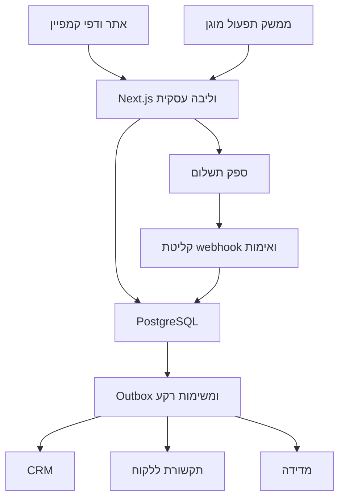

# Carrom Israel — אפיון האתר ומערכת המכירה

גרסה 0.1 · 24.09.2026 · מסמך עבודה לדיון, לתכנון ולפיתוח ב־Cursor

**מטרת המסמך:** להגדיר מסע לקוח מלא, משלב החשיפה ועד תשלום, אספקה ושירות, ולבנות תשתית שאפשר להשתמש בה בהמשך גם בעסקים נוספים. זהו אפיון היעד ותוכנית הביצוע; אין כאן טענה שאינטגרציות או רכיבים כבר מומשו.

**סטטוס החלטות:** “מאושר” משקף הוראה בשיחה; “המלצה” היא החלטת תכנון מוצעת; “פתוח” דורש מידע עסקי או בדיקת ספק. החלטות פתוחות אינן סיבה לעצור את עבודת ה־UI.

## 1. ההחלטה הניהולית

ההמלצה היא לבנות ליבה עסקית בבעלותכם: מוצרים, הזמנות, התאמת תשלומים, זהויות, אירועים וחיבורים לספקים. את עבודת אנשי המכירות — טיפול בלידים, תזכורות, תיעוד שיחות ובעלות על לקוח — עדיף להתחיל ב־CRM קיים המחובר לליבה.

Next.js יכול לשרת את ממשק האתר וגם את ה־API הנדרש. מסד הנתונים, עיבוד משימות הרקע וחיבורי הספקים הם רכיבים נוספים במערכת. אין צורך להקים עכשיו פלטפורמת SaaS, מערכת טלפוניה או ארכיטקטורת microservices.

מוצר ההשקה המומלץ: אתר איכותי, רכישה כאורח, סליקה מאומתת בשרת, הזמנות שניתן לתפעל, מדידה בסיסית אמינה ו־CRM קטן ומתפקד. התחברות לקוח, אוטומציות מתקדמות ואייגנטים יגיעו בעקבות צורך עסקי מדיד.

## 2. מה כבר נקבע ומה עדיין פתוח

| נושא | סטטוס | משמעות לביצוע |
|---|---|---|
| פרויקט Next.js קיים, פיתוח ב־Cursor | מאושר | משתלבים בפרויקט לאחר בדיקת המבנה והגרסאות שלו |
| פאזה ראשונה: UI וקישור לוואטסאפ | מאושר | סביבת עבודה פרטית; **זו אינה גרסת השקה** |
| תשלום אוטומטי, אנליטיקות, CRM ואוטומציות | מאושר כיעד | מפרקים לפאזות ולתנאי קבלה |
| חשבון Morning קיים | מאושר | הפעלת סליקה, הרשאות API ומסלול החשבון טרם אומתו |
| התחברות לקוחות | כיוון שהוצע | אופציונלית; אינה תנאי לרכישה |
| אתר בעברית, קהל חברים ומשפחות | מאושר | RTL, הסבר למי שאינו מכיר קארום, תכנון למובייל |
| קו עיצוב כהה ואיכותי | מאושר | ההירו הוא נקודת המוצא; שאר הסקשנים עדיין דורשים עיצוב |
| שימוש חוזר בעסקים עתידיים | מאושר כיעד | הפרדת הגדרות עסק וספקים, ללא בניית מערכת רב־עסקית מלאה כעת |
| מחירים, מלאי, משלוחים, החזרות ותקציב כלים | פתוח | חייבים להיסגר לפני סליקה חיה והשקה |

## 3. תוצאות עסקיות ומדדי הצלחה

האתר צריך להסביר במהירות מהו המשחק, להמחיש את המוצר, לעזור לבחור לוח ולאפשר רכישה עצמאית או שיחה שממשיכה להזמנה. המערכת התפעולית צריכה למנוע לידים שנשכחו, תשלומים שלא שויכו והזמנות שלא נשלחו.

| מדד | הגדרה | שימוש |
|---|---|---|
| לחיצות לוואטסאפ | אירוע מעבר מתוך האתר | מודד כוונה בלבד, לא ליד אמיתי |
| פניות שהתקבלו | הודעה נכנסת או טופס תקין שנוצרו במערכת | בסיס למשפך המכירות |
| לידים מתאימים | פניות שעומדות בהגדרה עסקית מוסכמת | למשל עניין בלוח ויכולת אספקה; ההגדרה פתוחה |
| שיעור פנייה לרכישה | לידים שהובילו להזמנה משולמת חלקי לידים, לפי קבוצת זמן | בוחן את עבודת המכירה |
| שיעור השלמת תשלום | הזמנות ששולמו חלקי הזמנות שעבורן נוצר ניסיון תשלום | חושף חיכוך בתשלום |
| זמן תגובה ראשון | זמן מפנייה נכנסת לתגובה אנושית מועילה | בוחן שירות ותפעול |
| עלות רכישת לקוח | הוצאה על קמפיין חלקי לקוחות חדשים שיוחסו אליו | מדווחים גם את שיעור העסקאות ללא ייחוס |
| תרומה להזמנה | הכנסה פחות עלות מוצר, סליקה, אספקה, החזרים ועלות רכישה מיוחסת | שיטת חישוב עקבית, כולל טיפול מוסכם במע״מ |
| חריגות תפעוליות | הזמנות תקועות, תשלומים לא מותאמים ומשימות שנכשלו | תור טיפול יומי |

לא נקבעים יעדי המרה או תקציבי פרסום ללא נתוני בסיס. מגדירים חלון מדידה, אוספים נתונים ראשונים ואז קובעים יעד. בדוחות משווים מסלולים לפי רכישות ורווחיות, לא רק לפי מספר קליקים.

## 4. פאזות ושערי מעבר

| פאזה | תכולה | תנאי סיום | חשיפה |
|---|---|---|---|
| P1 — UI | הירו, סקשנים, דגמים, רספונסיביות, motion וקישור WhatsApp | ביקורת עיצוב, מובייל, נגישות בסיסית ונכסים נכונים | פרטית בלבד |
| P2 — מערכת מכירה ראשונית | DB, הזמנות, תשלום, ממשק תפעול מוגן, מדידה בסיסית ו־CRM | תשלום מאומת מקצה לקצה, תפעול אספקה וחריגות, שער השקה מלא | גרסת ההשקה המומלצת |
| P3 — זהות ושירות עצמי | התחברות אופציונלית, הזמנות קודמות ועדכון פרטים | בעלות על הזמנה והרשאות מאומתות | ציבורית לאחר בדיקות |
| P4 — שיפור מכירות | חיבורי ערוצים, אוטומציות, ייחוס משופר ודוחות | תהליכים מדידים, מנגנוני עצירה ובעלות תפעולית | הפעלה הדרגתית |
| P5 — אייגנטים ושימוש חוזר | סיוע במענה, ניסוי קול אם מוצדק, חילוץ רכיבים לעסק נוסף | הוכחת ערך מול עלות, ניטור והעברה לאדם | ניסוי מוגבל לפני הרחבה |

המלצה: לבצע בדיקת יכולות Morning ובחירת CRM כבר במהלך P1, כדי לא לגלות מגבלה אחרי סיום העיצוב. אין פירוש הדבר להוסיף סליקה או פרטי API ל־UI לפני שהממשק מוכן.

לא נקבע לוח זמנים קשיח ללא בדיקת הריפו, זמינות תוכן ואישורי ספק. כל פאזה מסתיימת בהדגמה ובבדיקת תנאי הקבלה שלה.

## 5. האתר, דפי הקמפיין והעיצוב

### האתר הראשי

עמוד הבית מסביר את המוצר ואת המותג: הירו, הסבר על קארום, בחירת דגם, אירועים, המלצות ויצירת קשר. סדר הסקשנים המדויק עדיין פתוח. ניווט מצומצם מאפשר גם למבקר שחוזר למצוא דגמים, מידע ושירות.

### דפי קמפיין

מסלול לדוגמה: `/offers/hanukkah`. אותה מערכת עיצוב ואותה ליבת הזמנות, אך מסר, הצעה ותוכן מותאמים לקמפיין, עם ניווט מצומצם ופעולה ראשית אחת. משאירים גישה למידע מהותי, תנאים ויצירת קשר. אין צורך להקים אתר נפרד או לשכפל checkout לכל מבצע.

### הקו העיצובי

פחם הוא רקע בסיס, כחול עמוק משמש להדגשות או לאזורים נבחרים, והעץ של הלוח מוסיף חום. אין כלל של החלפת כחול ופחם בכל סקשן. אפשר לשלב אזור בהיר כשיש לו תפקיד בהיררכיה, לאחר בדיקה של הדף כולו.

ההירו המאושר הוא מקור ההשוואה החזותי. ההאדר נטמע ברקע, ללא divider וללא כפתור מכירה נוסף. תנועת כניסה עדינה ללוח מופעלת פעם אחת ומכבדת reduced motion. תמונת המוצר והטקסט נשארים זמינים גם אם האנימציה אינה פועלת. שאר הסקשנים שהוצגו אינם נחשבים מאושרים.

`design.md` יתאר צבעים, טיפוגרפיה, מרווחים, רוחבי תוכן, כפתורים, טיפול בתמונות, מצבי מובייל ואנימציה. המסמך הנוכחי הוא אפיון העסק והמערכת ואינו מחליף אותו.

### תוצרי P1

- עמוד בית שלם וזרימה למובייל, כולל תפריט ומצבי פוקוס.
- דגמים ותמונות נפרדים מקוד התצוגה; מחירי דמה מסומנים בסביבה הפרטית.
- CTA לוואטסאפ עם הודעה מוצעת לפי דגם, ללא הנחה שההודעה אכן נשלחה.
- חוזה אירועים מוכן בקוד, עם סביבת מדידה נפרדת וללא זיהום נתוני ייצור.
- סביבת preview מוגנת בגישה; `noindex` לבדו אינו אמצעי הגנה.

## 6. מסעות הלקוח

| מסלול | צעדים | מה צריך להישמר |
|---|---|---|
| רכישה עצמאית | תוכן/מודעה → אתר → דגם → פרטי לקוח ואספקה → תשלום → אישור | מקור תנועה, מחיר שננעל, הזמנה, ניסיון תשלום וסטטוס אספקה |
| מכירה מסייעת | אתר → WhatsApp → שיחה → בחירת לוח → קישור להזמנה ספציפית → תשלום | ליד, אחראי טיפול, סיכום שיחה וקישור בין הליד להזמנה |
| Instagram ישירות ל־WhatsApp | מודעה/פרופיל → שיחה → הזמנה → קישור תשלום | מקור אם זמין; אין ביקור באתר שאפשר להניח שהתרחש |
| לקוח חוזר | אתר → התחברות אופציונלית → הזמנות ושירות | זהות מאומתת והרשאות להזמנות שלו בלבד |
| שירות/החזר | פנייה → אימות זהות והזמנה → טיפול → עדכון כספי ותפעולי | היסטוריה, הרשאות, סיבת טיפול ותוצאה |

האתר ו־WhatsApp אינם מתחרים: שיחה יכולה להסתיים בתשלום באתר, ואתר יכול לייצר שיחה. ההשוואה בין ערוצי פרסום תיעשה באותה הגדרת לקוח משלם.

## 7. CRM: לקנות את כלי העבודה, לבנות את הליבה

**המלצה:** CRM קיים, עם שכבת חיבור שבבעלותכם. היכולת לפתח מהר אינה מבטלת את העלות של הרשאות, חיפוש, תיעוד, שחזור, תחזוקה וחיבורי תקשורת.

| חלופה | יתרון | מחיר תפעולי | מתי לבחור |
|---|---|---|---|
| CRM קיים כגון HubSpot | מודל לקוחות, עסקאות ופעילויות | התאמת תהליכים ובדיקת מסלול/עלויות | כשהצורך המרכזי הוא מכירות ויחסי לקוח |
| מערכת גמישה כגון monday CRM | התאמת תהליכי עבודה וצוות | הגדרת מבנה עקבי וחיבורים | כשניהול משימות ותפעול מרכזיים בתהליך |
| ממשק CRM מצומצם בפיתוח עצמי | שליטה מלאה והתאמה מדויקת | אחריות מלאה על תחזוקה ותפעול | כשהתהליך קטן או צורך ייחודי מוכח מצדיק זאת |

אין כאן בחירת ספק סופית. מריצים בדיקת התאמה עם שלושה מקרים: פנייה חדשה מוואטסאפ, תשלום ועדכון עסקה, ולקוח חוזר עם פנייה נוספת. בודקים גם API, הרשאות, יצוא נתונים, עלות משתמשים, מגבלות אוטומציה והחיבור הספציפי ל־WhatsApp. קיום API אינו הוכחה שחיבור WhatsApp הנדרש כלול במנוי.

אם בוחרים פיתוח עצמי, ה־MVP מוגבל לרשימת לידים, כרטיס לקוח, ציר זמן, משימה הבאה, בעלות טיפול, סינון והרשאות. אין צורך לבנות תיבת הודעות רב־ערוצית או מערכת שיחות קוליות בגרסה הראשונה.

### מודל המכירה ב־CRM

`new → contacted → qualified → awaiting_payment → won / lost`

אפשר לסגור ליד כלא רלוונטי בכל שלב עם סיבה. `won` נקבע בעקבות תשלום מאומת או חריג מתועד ומורשה, ולא בגלל לחיצה על כפתור. לקוח אחד יכול לייצר כמה פניות וכמה הזמנות. פנייה חוזרת אינה תמיד עסקה חדשה, ואסור שכל הודעה נכנסת תיצור ליד כפול.

לכל ליד פעיל יהיו אחראי, סטטוס ופעולה הבאה. יעד זמן תגובה ושעות פעילות ייקבעו לפי היכולת האמיתית של העסק.

## 8. ארכיטקטורה וגבולות אחריות

Next.js יטפל בתצוגה ובבקשות קצרות. משימות שדורשות retries, ריצה ארוכה או תזמון יטופלו במנגנון רקע מתמשך שמתאים לסביבת הפריסה. אין להסתמך על עבודה שמתחילה אחרי החזרת HTTP response בתהליך שעלול להיסגר.

המלצה להתחיל ב־modular monolith: יחידות קוד נפרדות ביישום אחד, DB מרכזי ושכבת jobs. אין צורך ראשוני ב־Kafka או Kubernetes. פריסה כ־static export בלבד לא מספיקה ל־API ול־webhooks המתוכננים. בחירת hosting, DB וספק jobs תיעשה לאחר בדיקת הפרויקט והתקציב.

### מקור אמת לכל מידע

| מידע | מקור אמת | כללי סנכרון |
|---|---|---|
| קטלוג, מחיר עסקי והזמנה | DB של הליבה | snapshot של הפריטים והמחיר נשמר בהזמנה |
| ביצוע חיוב/זיכוי | ספק התשלום | הליבה שומרת מזהי ספק וסטטוס מאומת; מבצעת התאמה תקופתית |
| מסמך חשבונאי | Morning/מערכת החשבונאות שנבחרה | שומרים מזהה וקישור מאובטח; לא מפיקים מסמך כפול עצמאית |
| בעלות על ליד, משימות ופעילות מכירה | CRM | מידע תפעולי אינו משנה סטטוס תשלום |
| מזהה לקוח פנימי והקשרים להזמנות | הליבה | מזהה יציב, נפרד מאימייל וטלפון |
| זהות התחברות | ספק/מנגנון Auth | קישור ללקוח רק אחרי אימות מתאים |
| מדדי התנהגות וייחוס | מערכת אנליטיקה | נתונים נגזרים; אינה ספר ההזמנות |

מתחילים בסנכרון מהליבה ל־CRM. סנכרון חוזר יוגבל לשדות מוגדרים, למשל אחראי טיפול וסטטוס מכירה. לכל שדה מסונכרן קובעים בעלות וכלל פתרון התנגשות כדי למנוע לולאות ודריסת מידע.

## 9. מודל הנתונים המינימלי

| ישות | תפקיד ושדות מרכזיים |
|---|---|
| Business / Site | מזהה עסק, אתר, הגדרות, ספקים ושפה |
| Product / Variant | SKU, שם, מחיר פעיל, זמינות ותמונות |
| Contact | מזהה לקוח, פרטי קשר, מצב אימות והסכמות |
| User / ContactLink | חשבון התחברות וקישור מאומת ללקוח |
| Lead | מקור, contact_id אם ידוע, סטטוס, אחראי והפעולה הבאה |
| Order / OrderItem | מזהה, לקוח, snapshot מחיר ומוצר, מטבע ופרטי אספקה |
| PaymentAttempt | הזמנה, ספק, מזהה ניסיון, סכום וסטטוס |
| Refund | תשלום מקור, סכום, סיבה וסטטוס נפרד |
| Fulfillment | הזמנה, מצב טיפול, פרטי משלוח/איסוף ומעקב |
| AttributionTouch | מקור, קמפיין, זמן ומזהה אנונימי כאשר מותר |
| Consent | מטרה, ערוץ, מקור, תאריך והסרה |
| WebhookInbox / OutboxJob | מניעת כפילויות, מצב עיבוד, ניסיונות ושגיאה אחרונה |
| ExternalMapping / AuditLog | מזהים בין מערכות ותיעוד פעולות רגישות |

הבחנה יסודית: אדם אינו חשבון התחברות; ליד אינו הזמנה; הזמנה אינה ניסיון תשלום. להזמנה אחת יכולים להיות כמה ניסיונות תשלום, והצלחה כפולה מחייבת טיפול ולא אספקה כפולה.

כסף נשמר ביחידות המטבע הקטנות כמספר שלם. אילוצי uniqueness מוגדרים למזהי ספק ומפתחות idempotency לפי העסק והספק. אין למזג לקוחות אוטומטית על בסיס שם בלבד.

## 10. תשלומים עם Morning

### בדיקת ספק לפני מימוש

באתר המפתחים של Morning מתועדות יכולות API, תשלומים, webhooks וסביבת sandbox. זו אינה הוכחה שהחשבון הקיים כבר זכאי ומוגדר לכל היכולות. יש לאמת:

1. סליקה פעילה, מסלול תומך וגישת API/sandbox.
2. יצירת עמוד תשלום לסכום שהשרת קובע, עם שיוך אמין להזמנה פנימית.
3. אופן קבלת הודעת תשלום, אימות מקורה ושליפת עסקה לאימות נוסף.
4. מזהי אירועים, ניסיונות מסירה חוזרת, סטטוסים וכשלי תשלום.
5. החזר מלא/חלקי, ביטול והפקת מסמכים לפי הגדרות העסק.
6. כתובות חזרה, תשלומים מאוחרים, מגבלות וקצב בקשות.

תוצר הבדיקה יהיה מסמך קצר עם פעולות API מאומתות, payloads מסוננים, מיפוי סטטוסים והחלטה אם Morning לבדה מספקת את התהליך. אם נדרש ספק סליקה נוסף, שומרים את אותה ליבה ומשנים adapter.

### תהליך checkout

1. הלקוח בוחר דגם; השרת מאמת SKU, מחיר וזמינות.
2. נאספים פרטי קשר ואספקה הנדרשים להזמנה. אימייל שנמסר אינו הוכחה לבעלות על חשבון קיים.
3. השרת מחשב סכום, משלוח והנחה מאושרת ויוצר הזמנה במצב `awaiting_payment`.
4. נוצר `PaymentAttempt` וקישור תשלום משויך להזמנה. מפתח idempotency מונע יצירה כפולה בעקבות לחיצה חוזרת.
5. הלקוח משלם בעמוד הספק; פרטי הכרטיס אינם נשמרים ביישום.
6. השרת מקבל הודעה, מאמת אותה בדרך שהספק תומך בה ובודק מזהה, סכום, מטבע ועסק.
7. בטרנזקציה נשמרים האירוע והעדכון העסקי, ונוצרות משימות outbox ל־CRM, אישור הזמנה ומדידה.
8. עמוד התודה מציג סטטוס מהשרת. עצם החזרה מהספק אינה הוכחת תשלום.

קישור תשלום קבוע יכול לסייע במכירה ידנית, אך אינו מחליף את שיוך ההזמנה והאימות בתהליך האוטומטי.

### מצבים וחריגות

- מצב תשלום: `pending / succeeded / failed / expired`. זיכויים מנוהלים בנפרד עם סכום מצטבר.
- מצב אספקה: `unfulfilled / processing / shipped / delivered / cancelled`, מותאם לאיסוף עצמי אם נדרש.
- timeout ביצירת תשלום: בודקים אם הספק כבר יצר ניסיון לפני retry עיוור.
- webhook כפול או שלא הגיע לפי הסדר: עיבוד idempotent והחלטה לפי מצב העסקה המאומת.
- תשלום התקבל אך המלאי נגמר, או התקבל לאחר פקיעת הזמנה: תור חריגות והחלטה אנושית.
- הזמנה שולמה פעמיים: התראה וטיפול בהחזר; לא שולחים שני לוחות אוטומטית.
- CRM או אנליטיקה נפלו: ההזמנה נשארת משולמת; החיבורים נשלחים מחדש ברקע.
- החזר: שינוי כספי אינו מחזיר מלאי אוטומטית לפני טיפול בהחזרת המוצר.

נדרש להחליט לפני השקה על מדיניות שמירת מלאי, משך ההזמנה, משלוחים, קופונים, תשלומים וסוגי מסמכים עם בעל העסק ואיש החשבונאות. אין להמציא מדיניות בתוך הקוד.

## 11. זהות, Login ולקוחות אורחים

רכישה כאורח תהיה מסלול מלא. התחברות אופציונלית תשרת צורך אמיתי: מעקב הזמנות, פרטים שמורים או שירות. אין להוסיף סיסמה רק כדי לשפר אנליטיקה.

ביקור אנונימי מזוהה במזהה דפדפן/מכשיר לפי הגדרות ההסכמה והכלי. הוא אינו חושף שם או טלפון. מחיקת cookies, מעבר מכשיר וחסימות מדידה מגבילים רציפות.

לאחר אימות זהות אפשר לקשר אירועים למזהה משתמש פנימי יציב לפי מודל הזהויות של Mixpanel. לא משתמשים באימייל גולמי כ־distinct_id. רישום טלפון בטופס או קוד שיוך בוואטסאפ אינם מספיקים למתן גישה להזמנות קיימות.

חשבון חדש יקבל גישה להזמנות עבר רק אחרי אימות והליך claim מוגדר. קישורי צפייה לאורח יהיו אקראיים, מוגבלים בהרשאות ובתוקף, ללא מידע רגיש בכתובת. מזהה הזמנה או UUID אינם אמצעי הרשאה.

**התחברות צוות נדרשת כבר ב־P2**, גם אם אין התחברות לקוחות: בעלים/מנהל, מכירות ותפעול עם הרשאות נפרדות לפעולות רגישות.

## 12. אנליטיקה, Meta וייחוס

### חלוקת התפקידים

- **Mixpanel:** משפך באתר, מסלולי שימוש וחיכוך במעבר בין דגם, פנייה ותשלום.
- **Meta Pixel / Conversions API:** מדידה ואופטימיזציה של פרסום ב־Meta, בכפוף להגדרות הסכמה ומדיניות רלוונטיות.
- **דוחות DB/CRM:** כסף שהתקבל, הזמנות, טיפול בלידים ואספקה.
- **GA4:** תוספת אם יש צורך בדוחות רכישת תנועה/Google; אין חובה להתקין כל כלי אפשרי ביום הראשון.

### חוזה אירועים

| אירוע פנימי | מי מפיק | תנאי אמת |
|---|---|---|
| `page_viewed` | דפדפן | טעינת עמוד בפועל |
| `product_viewed` | דפדפן | צפייה משמעותית בדגם לפי כלל מוגדר |
| `whatsapp_clicked` | דפדפן | לחיצה על מעבר לוואטסאפ |
| `inquiry_received` | שרת/CRM | הודעה נכנסת או טופס תקין שהתקבלו |
| `lead_qualified` | CRM/שרת | עמידה בקריטריונים שהוגדרו |
| `checkout_started` | שרת | יצירת תהליך checkout תקין |
| `payment_succeeded` | שרת | אישור תשלום מאומת |
| `refund_succeeded` | שרת | החזר מאומת |
| `order_fulfilled` | שרת/תפעול | השלמת מצב האספקה שהוגדר |

מעטפת האירוע: `event_id`, `event_name`, `occurred_at`, `business_id`, `site_id`, `anonymous_id` אם קיים, `user_id` אם אומת, `order_id` לפי צורך, `source`, `campaign`, `schema_version` ומצב ההסכמה. אירועי כסף כוללים `value` ו־`currency` לפי הגדרה עקבית של הסכום המדווח.

לא מעבירים טקסטי שיחה, כתובות, פרטי כרטיס או פרטי קשר גולמיים לאירועי התנהגות. מיפוי שדות התאמה ייעודיים ל־Meta, אם מופעל, נעשה בנפרד ובהתאם לדרישות הכלי ולהסכמה. hashing אינו הופך מידע למידע נטול רגישות.

אם אותו Purchase נשלח מהדפדפן ומהשרת, משתמשים באותו `event_name` ובאותו `event_id` בהתאם למנגנון deduplication של Meta. אפשר להתחיל בשליחה מהשרת בלבד לאירוע התשלום ולהימנע משני מקורות מיותרים.

### ייחוס בין האתר ל־WhatsApp

שומרים first touch ו־last touch עם timestamps וכללי חלון ייחוס. פרמטרי UTM ומזהי קליק נשמרים כאשר מותר וזמינים. אין להניח שכל עסקה ניתנת לייחוס.

בהודעה המוצעת לוואטסאפ אפשר לשלב קוד מקור קצר. הלקוח יכול לשנות או למחוק אותו, ולכן הוא רמז לשיוך ולא הוכחת זהות. באמצעות חיבור WhatsApp מתאים אפשר לקלוט הודעות ולשייך מקור זמין; בקישור `wa.me` רגיל האתר אינו מקבל אישור שהודעה נשלחה.

לא מכנים `whatsapp_clicked` בשם Lead. מפרידים בדוח בין אתר, פנייה, ליד מתאים, ניסיון תשלום ותשלום. מסלול ישיר מ־Instagram לוואטסאפ יכול להצטרף למשפך רק משלב הפנייה.

## 13. אוטומציות ותקשורת

| טריגר | פעולה מוצעת | תנאי ומנגנון עצירה |
|---|---|---|
| פנייה חדשה | upsert לקוח, פתיחת ליד/שיוך לפנייה פעילה, הקצאת מטפל | מניעת כפילויות ושעות פעילות |
| ליד ללא טיפול | משימה והתראה פנימית | SLA מוסכם; לא ספאם לצוות |
| נשלח קישור תשלום | תזכורת למטפל; בהמשך תזכורת ללקוח | אין תשלום, ערוץ מותר, מספר ניסיונות מוגבל |
| תשלום הצליח | אישור הזמנה, עדכון CRM ומשימת אספקה | פעם אחת לכל תשלום עסקי; טיפול נפרד בניסיון כפול |
| יצא משלוח | עדכון לקוח | פרטי משלוח מאומתים וערוץ תקין |
| אספקה הושלמה | בקשת משוב לאחר מרווח מוסכם | אין תלונת שירות פתוחה; בכפוף להרשאות תקשורת |
| כשל אינטגרציה | retry ואז תור חריגות | backoff, תקרת ניסיונות ואחראי טיפול |

מפרידים הודעת שירות מהודעה שיווקית והסכמה לכל מטרה. WhatsApp Business Platform מחייב כללי הודעות ותבניות לפי סוג הפנייה והמצב; יש לאמת את המסלול עם הספק שנבחר. אי אפשר להניח שכל הודעה חופשית מותרת בכל זמן.

תזכורת מכירה נעצרת כשיש תשלום, סירוב, הסרה, סגירת ליד או תגובת לקוח שמחזירה את הטיפול לאדם. פעולה שנוסחה על ידי AI אינה נחשבת הודעה שנשלחה עד שמתקבל אישור ממערכת הערוץ.

## 14. אייגנטים ו־ElevenLabs

השימוש הנכון הראשוני הוא עזרה למפעיל: סיכום שיחה, חילוץ דגם מבוקש, הצעת פעולה הבאה וטיוטת תשובה. לאחר שיש ידע מסודר ונתונים אפשר לבדוק מענה אוטומטי מצומצם.

| רמה | תפקיד | סמכות |
|---|---|---|
| A | סיכום ותיוג שיחה | כתיבת טיוטה/שדות לא רגישים, עם תיעוד |
| B | הצעת תשובה ופעולה | אדם מאשר שליחה |
| C | מענה לשאלות מוגדרות | נתוני מוצר ממקור מאושר והעברה לאדם כשחסר מידע |
| D | קול באמצעות ספק כגון ElevenLabs | ניסוי יזום ומוגדר, למשל חזרה למתעניין שביקש שיחה |

אין לאייגנט סמכות עצמאית לתת הנחה, לבצע החזר, לשנות מחיר, להבטיח מלאי או לסגור עסקה כששאלת הלקוח אינה פתורה. כל tool call עובר הרשאות ואימות בשרת. מחירים, מלאי וסטטוס הזמנה מגיעים מכלים מוסמכים, לא מזיכרון המודל.

לפני קול: מגדירים הסכמה, זיהוי השירות האוטומטי, מדיניות הקלטה ושמירה, העברה לאדם ומגבלת עלות. בודקים איכות בעברית, זמן תגובה, דיוק וסיום שיחות. יכולת post-call webhook של ElevenLabs מסייעת לקבל תוצאה וסיכום; אינה מחליפה בדיקת איכות או ניהול לידים.

מדד הצלחה לניסוי: זמן טיפול שנחסך ושביעות רצון, לצד טעויות, העברות לאדם ועלות לשיחה. לא מפעילים אייגנט רק משום שהטכנולוגיה זמינה.

## 15. אמינות, אבטחה ותפעול

- הפרדה בין development, staging ו־production: מפתחות, DB, אנליטיקה ותורים נפרדים.
- סודות נשמרים בשרת; אין מפתחות ספק ב־client bundle או משתני סביבה ציבוריים.
- הרשאה לכל גישה להזמנה, לכל פעולה תפעולית ולכל עסק. מזהה שמגיע מהדפדפן אינו מקור סמכות.
- rate limits והגנות ניצול על טפסים, יצירת תשלום, אימות וקישורי אורח.
- webhook מקבל תשובה מוצלחת רק אחרי אימות ושמירה עמידה לפי חוזה הספק; המשך הטיפול יכול להיות אסינכרוני.
- עיבוד חוזר בטוח, backoff, תור כשלונות ואפשרות replay מבוקרת.
- reconciliation מתוזמן מול ספק התשלום לאיתור webhooks חסרים ופערי סטטוס.
- audit log להחזרים, שינויי סכום, הרשאות ומעברים ידניים רגישים.
- לוגים עם correlation IDs וללא פרטי כרטיס, שיחות מלאות או סודות.
- גיבויים ובדיקת שחזור; יעדי אובדן מידע וזמן התאוששות נקבעים לפי ההיקף והתקציב.
- תקלה ב־CRM אינה עוצרת קבלת תשלום. התקלה מופיעה לתפעול ומסונכרנת בהמשך.

לפני פרסום נדרשת מדיניות פרטיות, הסכמה, שמירה/מחיקה, נגישות, משלוחים והחזרות המתאימה לעסק ולדין החל. הסעיף מגדיר משימת השקה ולא קובע נוסח משפטי. מחיקת מידע חייבת להביא בחשבון חובות שמירת מסמכי עסק ואינטגרציות חיצוניות.

## 16. שימוש חוזר בעסקים נוספים

בונים כבר עכשיו גבולות מודולריים: `catalog`, `orders`, `payments`, `identity`, `crm`, `tracking`, `communications` ו־`jobs`. ממשקי הספקים נשארים נפרדים מהלוגיקה העסקית.

ממשקים רעיוניים לדוגמה: `createCheckout`, `verifyPayment`, `requestRefund`, `upsertContact`, `upsertDeal`, `sendTransactionalMessage`, `trackEvent`. אין לראות בהם שמות endpoints של ספק כלשהו.

הגדרות עסק כוללות branding, מוצרים, מטבע, ערוצים, חשבונות סליקה, יעדי CRM והרשאות. שימוש ב־`business_id` הוא בסיס לקישור מידע, לא הוכחת בידוד בפני עצמו.

בתחילה אפשר לפרוס כל עסק בנפרד ולהשתמש בקוד משותף. אחרי המימוש השני יהיה מידע טוב יותר על מה באמת כללי. אין לשתף לקוחות, cookies, מפתחות סליקה או הסכמות בין עסקים אוטומטית, גם אם הם בבעלות אותו אדם. שילוב עתידי דורש הגדרה מפורשת של גבולות המידע וההרשאות.

## 17. Backlog וסדר עבודה

| מזהה | עבודה | תלות | בעלות מוצעת | תוצר קבלה |
|---|---|---|---|---|
| F01 | בדיקת הפרויקט הקיים | גישה לריפו | פיתוח | מבנה, תלויות ופריסה מתועדים |
| F02 | סגירת תוכן, תמונות ודגמים | בעל העסק | עסק + עיצוב | חומרים אמיתיים ומסומנים |
| F03 | השלמת UI ו־design.md | F01–F02 | פיתוח + עיצוב | P1 פרטי מאושר |
| S01 | בדיקת Morning | חשבון והרשאות | פיתוח + עסק | checkout ו־webhook ב־sandbox מוכחים |
| S02 | בחירת CRM | תקציב ותרחישי טיפול | עסק + פיתוח | בדיקת שלושת התרחישים והחלטה כתובה |
| B01 | סכמת DB ומעברי מצב | מדיניות מוצר/אספקה | פיתוח | migrations ואילוצי נתונים |
| B02 | checkout ואימות תשלום | S01 + B01 | פיתוח | תשלום וחריגות עוברים E2E |
| B03 | inbox/outbox ו־jobs | B01 | פיתוח | retry ו־replay ללא פעולה כפולה |
| B04 | ממשק תפעול והרשאות | B01 | פיתוח + תפעול | טיפול הזמנה ואספקה אפשרי |
| C01 | חיבור CRM מינימלי | S02 + B03 | פיתוח | ליד ותשלום מסתנכרנים |
| A01 | חוזה אירועים ומדידה | הגדרת משפך | פיתוח + שיווק | אירועים מאומתים, ללא כפילויות |
| Q01 | בדיקת השקה מלאה | B02–A01 + תוכן | פיתוח + עסק | שער ההשקה חתום |
| I01 | התחברות לקוחות | צורך שירותי מוגדר | פיתוח | claim והרשאות להזמנות |
| M01 | אוטומציות מכירה | תהליך ידני שעובד | עסק + פיתוח | עצירה, ניטור ותוצאה מדידה |
| AG01 | ניסוי אייגנט | ידע, הרשאות ונתוני בסיס | עסק + פיתוח | ערך מוכח והעברה לאדם |

המסלול הקריטי להשקה הוא הגדרות מסחריות → ספק תשלום מוכח → הזמנה ותשלום → אספקה ותפעול → בדיקת קצה לקצה. Login ואייגנטים אינם על המסלול הקריטי המומלץ.

## 18. בדיקות ושער השקה

### P1 — סיום פנימי

- התאמה למקור העיצוב, RTL ומובייל אמיתי.
- קישור וואטסאפ והודעה נכונים לכל מקום באתר.
- keyboard navigation, ניגודיות, טקסט חלופי ו־reduced motion.
- תמונות מותאמות לגודל, ללא קפיצת layout חריגה; בדיקת ביצועים במכשיר נייד.
- אין המלצות, אירועים, מלאי או מחירים מומצאים שמוצגים כתוכן מאושר.

### P2 — לפני פרסום

- תשלום מוצלח, כשל, ביטול, timeout, callback כפול ו־webhook חסר.
- סכום שונה שנשלח מהדפדפן אינו משנה מחיר שרת.
- רענון ולחיצה כפולה אינם יוצרים חיוב כפול.
- לקוח אחד אינו רואה הזמנות של אחר; צוות מקבל הרשאות לפי תפקיד.
- CRM מושבת זמנית: הזמנה נשמרת, משימה חוזרת ומסתנכרנת פעם אחת.
- אישור, מסמך חשבונאי ומצב אספקה תואמים לעסקה.
- תשלום מופיע פעם אחת במדידה; קליק לוואטסאפ אינו נרשם כתשלום או כפנייה שהתקבלה.
- תרחיש החזר ותשלום מאוחר מגיעים לתוצאה ידועה ולתיעוד.
- יש אחראי לתור חריגות, לתמיכה ולמשלוחים, ויכולת תפעול בלי גישה לקוד.
- גיבוי, ניטור והגדרות ייצור נבדקו; מסמכי עסק ופרטיות הושלמו.

לאחר sandbox ולפני השקה נדרשת עסקת ייצור מבוקרת באישור בעל העסק, כולל בדיקת המסמך והטיפול בהחזר אם נדרש. מסמך זה אינו מבצע עסקה ואינו אישור לחיוב בפועל.

## 19. שגרת ניהול ועלויות

**יומי:** פניות ללא מטפל, הזמנות משולמות שלא עברו לאספקה, תשלומים לא מותאמים ומשימות אינטגרציה שנכשלו.

**שבועי:** משפך לפי מקור, זמן תגובה, סיבות הפסד, שיחות שהסתיימו בלי הצעה ובעיות checkout. בוחרים שיפור אחד על בסיס נתונים.

**חודשי:** עלות כלים, עלות טיפול ללקוח, תרומה להזמנה, איכות אוטומציות, גיבויים והרשאות צוות.

סעיפי תקציב: hosting, DB, jobs, CRM לפי מושבים/מסלול, עמלות סליקה, מערכת חשבונאות, ערוצי הודעות, אנליטיקה, ניטור, אימייל/SMS ואייגנטים. בודקים עלות בשלושה תרחישי היקף עסקיים לפני רכישת כלים. אין במסמך מחירוני ספקים או הנחה שמסלול חינמי יספיק.

## 20. החלטות פתוחות — לפי דחיפות

### דרושות לפני תכנון checkout

1. אילו דגמים נמכרים, מה כלול בכל ערכה ומה המחיר? האם מתחילים ברכישת לוח אחד או סל מרובה פריטים?
2. איך מתבצעת אספקה: משלוח, איסוף או שניהם? מה העלות, אזורי השירות וזמני האספקה?
3. מי מנהל מלאי ומה קורה כשמוצר חסר?
4. איזה מסלול Morning פעיל והאם הופעלו סליקה ו־API?

### דרושות לבחירת CRM וערוצים

5. כמה אנשים יטפלו בפניות ובהזמנות, ובאיזה תקציב חודשי לכלים?
6. האם עובדים כרגע ב־WhatsApp Business רגיל, או שקיים חיבור Platform/ספק?
7. איזה מידע באמת צריך לראות במסך טיפול בליד, ומה התהליך הידני הנוכחי?

### אפשר לדחות לאחר השלמת הליבה

8. מה הערך הקונקרטי של Login ללקוח?
9. איזה תהליך מצדיק אייגנט, ומה היקף השיחות הצפוי?
10. מהו העסק הבא שישתמש בתשתית, והאם הוא חולק צוות ותפעול או רק קוד?

## 21. הצעד הבא המומלץ

משלימים את P1 בפרויקט הקיים, ובמקביל סוגרים את ארבע ההחלטות המסחריות הראשונות ומבצעים בדיקת Morning. לאחר מכן בונים מסלול אחד שלם: **בחירת לוח → הזמנה → תשלום מאומת → משימת אספקה → רישום ב־CRM ובאנליטיקה**. רק אחרי שהמסלול הזה אמין, מוסיפים מסלולים ואוטומציות.

המסמך משמש בסיס ל־issues ולתכנון הספרינט; הוא אינו prompt לבנות הכול בבת אחת. כל משימה מקבלת תוצר, תנאי קבלה ומידע עסקי נדרש. שינויים בהחלטות מעדכנים כאן לפני שמפזרים אותם בין prompts.

## 22. מקורות טכניים ובדיקות ספק

מקורות רשמיים שנבדקו לצורך האפיון ב־24.09.2026. דפי API, מסלולים ויכולות יכולים להשתנות; המימוש מחייב אימות מול תיעוד פעיל והחשבון בפועל.

- [Morning — אתר המפתחים](https://developers.morning.co/) — API, תשלומים, webhooks ו־sandbox. בעת המימוש יש לאמת גישה פעילה ותיעוד endpoint; אין במסמך התחייבות ליכולות החשבון שלכם.
- [Morning — קישור לתשלום](https://www.greeninvoice.co.il/help-center/create-payment-link/)
- [Morning — בקשת תשלום באשראי](https://www.greeninvoice.co.il/help-center/credit-payment-request/)
- [Next.js — Backend for Frontend](https://nextjs.org/docs/app/guides/backend-for-frontend)
- [Next.js — Route Handlers](https://nextjs.org/docs/app/getting-started/route-handlers)
- [Mixpanel — Simplified ID Merge](https://docs.mixpanel.com/docs/tracking-methods/id-management/identifying-users-simplified)
- [Meta — Server Event Parameters](https://developers.facebook.com/documentation/ads-commerce/conversions-api/parameters/server-event)
- [Meta — Deduplicate Pixel and Server Events](https://developers.facebook.com/documentation/ads-commerce/conversions-api/deduplicate-pixel-and-server-events)
- [Meta — Business Chats on WhatsApp](https://about.fb.com/news/2025/04/ways-to-manage-your-businesses-chats-on-whatsapp/)
- [WhatsApp — Ads That Click to WhatsApp](https://whatsappbusiness.com/products/ads-that-click-to-whatsapp/)
- [monday — API](https://developer.monday.com/api-reference)
- [monday — Webhooks](https://developer.monday.com/api-reference/reference/webhooks)
- [HubSpot — Deals Object](https://developers.hubspot.com/blog/a-developers-guide-to-hubspot-crm-objects-deals-object)
- [ElevenLabs — Post-call Webhooks](https://elevenlabs.io/docs/eleven-agents/workflows/post-call-webhooks)
- [ElevenLabs — Agent Tools](https://elevenlabs.io/docs/eleven-agents/customization/tools)
